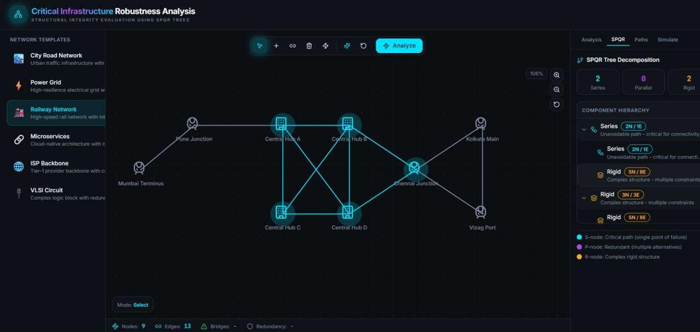
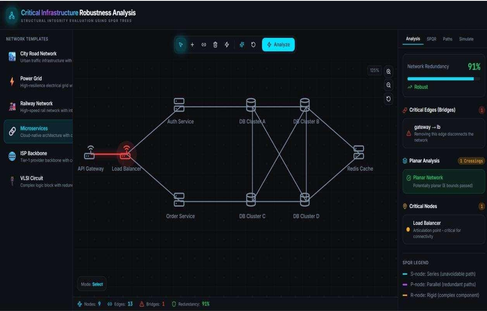

# Critical Infrastructure Robustness Analysis Using SPQR Trees

Advanced robustness analysis system for critical infrastructure networks.

[](https://urban-flow-guardian-main.vercel.app)

## 🚀 Live Demo
Access the live application here: **[https://urban-flow-guardian-main.vercel.app](https://urban-flow-guardian-main.vercel.app)**

## 📺 Video Walkthrough
Watch the system in action: **[Full Project Demonstration & SPQR Logic Overview](https://drive.google.com/file/d/1LMEfdguNcsETBH8DTsGoyKDnESaBHU1G/view?usp=sharing)**

## 📷 System Gallery

### 1. SPQR Tree Decomposition

*Visualizing the structural decomposition into Series (vulnerable), Parallel (redundant), and Rigid (complex core) components.*

### 2. Pathfinding & Flow Analysis

*Analyzing optimal routes and multi-path redundancy between critical infrastructure nodes.*

### 3. Structural Redundancy Evaluation

*Automated calculation of network redundancy scores and identification of planar vs. non-planar topologies.*

### 4. Vulnerability & Bridge Detection

*Real-time highlighting of 'Bridges' (critical single points of failure) and 'Articulation Points' within the network.*

## 🛠️ Core Functionality

### 1. SPQR Decomposition (Hopcroft-Tarjan Algorithm)
The heart of the system is the implementation of SPQR tree decomposition. This allows us to break down any biconnected graph into four node types:
- **S-Nodes (Series):** Represents linear chains. In infrastructure, these are "bottlenecks" where any failure disconnects the flow.
- **P-Nodes (Parallel):** Represents redundant paths. These are the "safe zones" of a network where traffic can be rerouted.
- **R-Nodes (Rigid):** Represents complex, 3-connected meshes that provide maximum stability.
- **Q-Nodes:** Represents basic edges (simplified in our visualization).

### 2. Real-time Infrastructure Analysis
The system provides a dashboard that calculates:
- **Redundancy Score:** A percentage-based metric of how much of your network is protected by alternative routes.
- **Critical Edge Detection:** Using Tarjan's bridge-finding algorithm to highlight edges that, if cut, would isolate parts of the city.
- **Planarity Testing:** Determining if the network can be laid out without "wire-crossings," which is vital for VLSI design and urban planning.

### 3. Interactive Simulation
- **Dynamic Graph Manipulation:** Add/remove nodes and edges in real-time to simulate infrastructure failures.
- **Network Presets:** Includes templates for City Roads, Power Grids, Railway Networks, and Microservices.

## 💻 Technical Stack

- **Frontend:** React with TypeScript
- **Styling:** CSS3, Tailwind CSS, shadcn/ui
- **Algorithms:** Custom TypeScript implementations of:
  - Tarjan's Biconnected Components
  - Hopcroft-Tarjan SPQR Logic
  - Planarity Verification
  - Dijkstra/BFS for Pathfinding
- **Visualization:** D3-inspired custom SVG rendering engine

## 🚀 Getting Started

### Prerequisites
- Node.js (v18 or higher)
- npm or yarn

### Installation
```sh
# Clone the repository
git clone https://github.com/sahanavs-2006/Advanced-Data-Structure-SPQR-Tree.git

# Navigate to the project directory
cd Advanced-Data-Structure-SPQR-Tree

# Install dependencies
npm install

# Start the development server
npm run dev
```

The application will be available at `http://localhost:8080`

## 📄 License
MIT License
